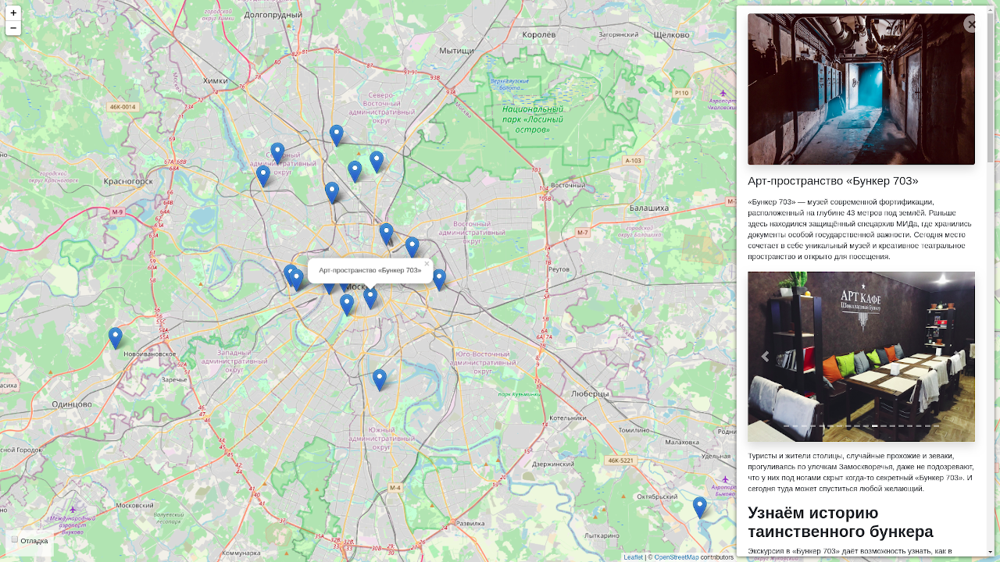

# Афиша - куда пойти?
Карта с достопримечательностями Москвы.

- [Демка сайта](https://j0hntv.pythonanywhere.com/)
- [Админка](https://j0hntv.pythonanywhere.com/admin/)



## Установка:
```
git clone https://github.com/j0hntv/Afisha.git
python3 -m venv env
. env/bin/activate
pip install -r requirements.txt
```

## Настройка переменных окружения:
Создать файл `.env` в корне проекта:

```
SECRET_KEY=...
```
Для режима отладки:
```
DEBUG=True
```

## Добавление в базу данных интересных мест:
```
python manage.py load_place http://адрес/файла.json
```
- Пример [json-файла](https://github.com/devmanorg/where-to-go-places/blob/master/places/%D0%90%D0%BD%D1%82%D0%B8%D0%BA%D0%B0%D1%84%D0%B5%20Bizone.json)

- В файле `.examples/place_links.txt` лежат ссылки на несколько интересных мест, добавить их все сразу можно одной командой (Linux):
```
cat .examples/place_links.txt | xargs python manage.py load_place
```

## Запуск:
```
python manage.py runserver
```
Открыть [страницу](http://127.0.0.1:8000/) 

## Цели проекта

Код написан в учебных целях — это урок в курсе по Python и веб-разработке на сайте [Devman](https://dvmn.org).

Тестовые данные взяты с сайта [KudaGo](https://kudago.com).
